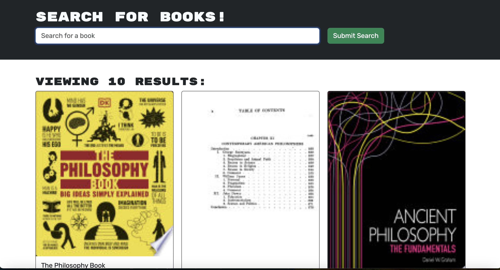

# MERN-book-search-GraphQL

## Description

A fully functional Google Books API search engine built with RESTful API, and GraphQL API built with Apollo Server. Uses the MERN stack with a React front end, MongoDB database, and Node.js/Express.js server and API.

## Table of Contents
        
- [Installation](#installation)
- [Usage](#usage)
- [Credits](#credits)
- [License](#license)

## Installation

This application uses GraphQL, Apollo Server, React, MongoDB, Node.js and Express.js and is deployed on Render.

## Usage

This application is deployed using Render and can be used with the following link: https://mern-book-search-graphql-2ztd.onrender.com/

## Credits
        
GitHub: https://github.com/RickHennessey87
Email: pjhennessey89@gmail.com

## License
    
This project is covered by the MIT License license.

[MIT License](https://opensource.org/licenses/MIT)
